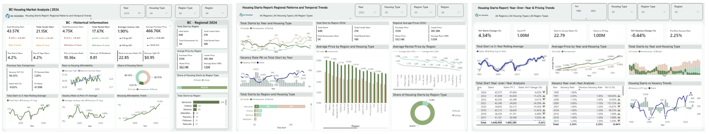
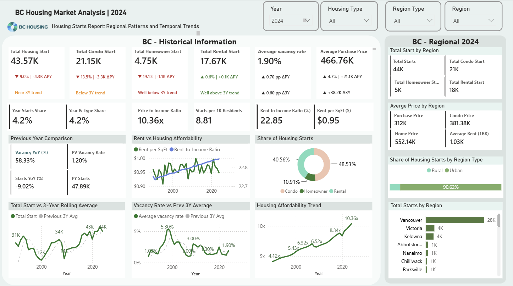
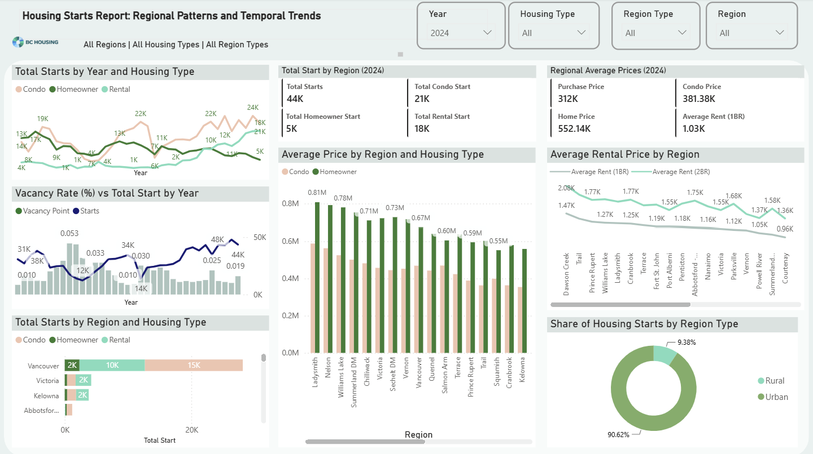
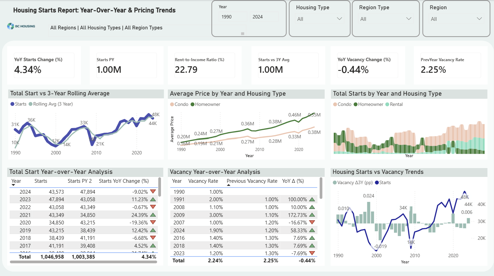

# 🏠 BC Housing Market Analytics Dashboard

An end-to-end Business Intelligence project that transforms more than 30 years of British Columbia housing market data into interactive dashboards and actionable business insights using SQL, Power BI, DAX, and Power Query.

This project demonstrates the complete analytics lifecycle—from data exploration and transformation to data modeling, KPI development, interactive dashboards, and business insights that support evidence-based decision-making.

> **Note**
>
> The original dataset is not included in this repository due to data sharing and licensing considerations.
>
> This repository focuses on the complete Business Intelligence workflow, dashboard development, analytical methodology, and business insights rather than the underlying data.
---

## 📊 Dashboard Overview

  

**Executive Summary** · **Regional Analysis** · **Trend Analysis**

---

## 📖 Project Overview

British Columbia's housing market has experienced significant changes over the past three decades, driven by population growth, regional development, housing supply, affordability challenges, and changing market conditions.

This project was developed to transform historical housing data into an interactive Business Intelligence solution that enables stakeholders to explore market trends, monitor key performance indicators (KPIs), compare regional housing conditions, and support data-driven decision-making.

Using SQL and Power BI, the project covers the complete analytics workflow—from data exploration, validation, and transformation to dimensional data modeling, KPI development, dashboard design, and business insight generation.

---

## 🎯 Business Objectives

The primary objective of this project was to build an end-to-end Business Intelligence solution that enables users to explore historical housing market trends across British Columbia and support evidence-based decision-making.

Specifically, the project aimed to:

- Analyze more than 30 years of historical housing market data.
- Evaluate regional differences in housing supply, affordability, and market activity.
- Monitor key housing indicators through interactive KPI dashboards.
- Identify long-term trends and emerging patterns across multiple housing categories.
- Provide executive-level reporting through interactive data visualizations.
- Transform complex housing data into actionable business insights for planning and policy evaluation.

---

## 🛠 Analytics Workflow

The project follows a complete end-to-end Business Intelligence workflow, transforming raw housing data into interactive dashboards and actionable business insights.

### 1️⃣ Data Exploration

- Explored historical British Columbia housing datasets.
- Reviewed data structure, data quality, and available attributes.
- Identified analytical requirements and business questions.

### 2️⃣ Data Preparation & Transformation

Using Power Query, the data was prepared through:

- Data cleaning and validation
- Data type standardization
- Filtering unnecessary records
- Merge and Append operations
- Grouping and aggregations
- Creation of calculated columns
- Data transformation and restructuring

### 3️⃣ Data Modeling

- Designed a dimensional data model.
- Established relationships between tables.
- Optimized the model for analytical reporting.

### 4️⃣ DAX Measures & KPI Development

Developed a comprehensive set of DAX measures and analytical metrics to support executive reporting, housing supply analysis, affordability assessment, regional comparison, and long-term trend evaluation.

The measures covered several analytical areas:

#### Housing Supply & Composition
- Total Housing Starts
- Condo Starts
- Homeowner Starts
- Rental Starts
- Housing Type Share (%)
- Selected Starts Share (%)
- Condo-to-Rental Ratio

#### Affordability & Market Conditions
- Average Housing Price
- Average Vacancy Rate (%)
- Rent-to-Income Ratio
- Price-to-Income Ratio
- Average Price per Housing Start
- Rental Starts per Vacancy Point

#### Time Intelligence & Trend Analysis
- Previous-Year Housing Starts
- Year-over-Year Change in Housing Starts (%)
- Previous-Year Vacancy Rate
- Year-over-Year Vacancy Rate Change (%)
- Three-Year Rolling Average
- Current-Year and Historical Trend Measures

#### Regional & Interactive Analysis
- Regional Housing Starts
- Urban vs. Rural Housing Share
- Dynamic Measures by Year, Region, and Housing Type
- Filter-responsive KPI calculations
- Benchmark and reference-line measures

The DAX logic applied filter context, time-intelligence functions, relationship management, conditional calculations, and dynamic aggregation to support interactive analysis across years, regions, and housing categories.

### 5️⃣ Dashboard Development

Designed interactive Power BI dashboards including:

- Executive Summary
- Cluster Analysis
- Trend Analysis

### 6️⃣ Business Insights

The final dashboards transform historical housing data into actionable insights that support evidence-based planning, regional comparison, and long-term housing market analysis.

---

## ⚙️ Technology Stack

| Category | Technologies |
|----------|--------------|
| Business Intelligence | Power BI |
| Data Querying | SQL |
| Data Transformation | Power Query |
| Data Modeling | Star Schema, Relationship Modeling |
| Data Analysis | DAX, KPI Development |
| Data Visualization | Interactive Dashboards, Executive Reporting |
| Data Preparation | Data Cleaning, Validation, Merge, Append, Group By, Filtering |

---

## 📊 Dashboard Preview

### Executive Summary

  

Provides a high-level overview of housing market performance through executive KPIs and interactive visualizations.
---

### Cluster Analysis

  

Compares regional housing markets using cluster-based analysis to identify similarities and market patterns.
---

### Trend Analysis

  

Visualizes long-term housing trends, supporting the analysis of market growth, affordability, and housing supply over time.

---

# 💡 Key Business Insights

The dashboards provide decision-makers with interactive insights into long-term housing market performance across British Columbia.

Key findings include:

- Regional differences in housing supply and market activity.
- Long-term housing affordability trends.
- Changes in housing starts across different housing categories.
- Regional performance comparisons through cluster analysis.
- Historical market trends supporting evidence-based planning.

---

# 🏆 Skills Demonstrated

- Business Intelligence
- Power BI Dashboard Development
- SQL Data Analysis
- Power Query (ETL)
- Data Cleaning & Transformation
- Data Modeling (Star Schema)
- DAX Measures & KPI Development
- Executive Reporting
- Data Visualization
- Business Analysis
- Data Storytelling

---

## 📬 Contact

If you'd like to discuss this project or connect, feel free to reach out:

- **LinkedIn:** https://www.linkedin.com/in/m-bahari
- **Email:** mism.bahari@gmail.com

